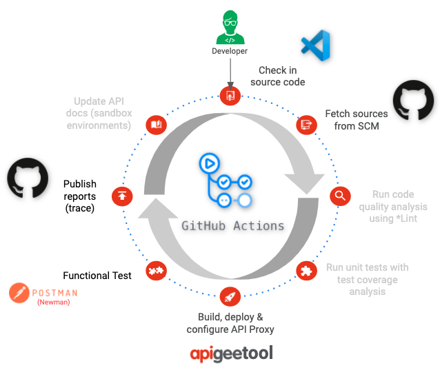

# Apigee CI/CD: Petstore v1 Proxy

This contains an example proxy for the Apigee CI/CD pipeline demonstration using GitHub Actions. 
It will deploy:
- Shared flows, Proxies and Configuration objects (KVM, Cache, Target Server, Api Product, App. Developer, ...) will be deployed with [`g-lalevee/apigeetool-action`](https://github.com/g-lalevee/apigeetool-deployment-action)
- Proxies will be tested with [`g-lalevee/newman-test-action`](https://github.com/g-lalevee/newman-test-action)

It can be created from template [`g-lalevee/apigeetool-deployment-template`](https://github.com/g-lalevee/apigeetool-deployment-template).

### Overview

